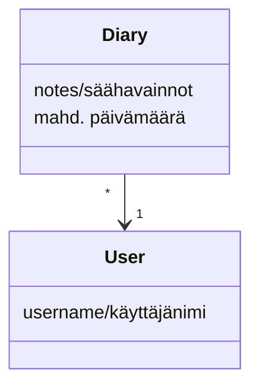

# Arkkitehtuurikuvaus #

## Sovelluksen rakenne ##

Sovellus koostuu neljästä pääosiosta. *Base* pitää sisällään sovelluksen tarvitsemat luokat, joita sovellus käyttää kohdetyyppeinä. *Ui* vastaa sovelluksen käyttöliittymään liittyvästä koodista, ja *services* taas sovelluslogiikasta. *Working* sisältää tietojen tallennuksen toiminnallisuuden.

## Käyttöliittymä ##

Sovelluksen käyttöliittymässä on tietyt näkymät, jotka ovat

1. Kirjautumisikkuna
2. Ikkuna uuden käyttäjän luomiselle
3. Näkymä kirjatuista säähavainnoista

Kaikilla näkymillä on oma toteutusluokka ui-osiossa. Kaikkien toiminnallisuudesta vastaa luokka UI. Sovelluslogiikka ja käyttöliittymä ovat erillisiä toisistaan, jotta koodia olisi helpompi lukea.

## Sovelluslogiikka ##

Luokat Note ja Diary toimivat sovelluksen pohjana, ja kuvaavat sovellukseen kirjautunutta käyttäjää sekä tämän kirjaamia käyttäjän säähavaintoja.

Luokka NoteService hoitaa sovelluksen toiminnallisuuden. Se mahdollistaa käyttöliittymän toiminnan erilaisilla metodeilla.

## Tietojen talletus ##

Tietoja tallennetaan working-osion luokissa *Note* ja *AboutUsers*. Kaikki käyttäjät tallentuvat AboutUsers-luokan avulla SQLite-tietokantaan, ja käyttäjien muistiinpanot taas yhteen csv-tiedostoon.
