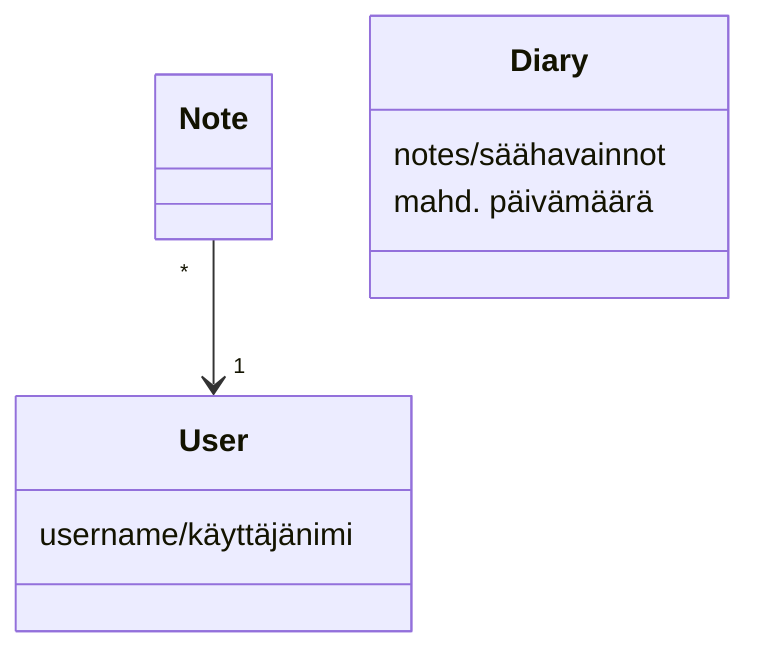

## Arkkitehtuurikuvaus ##

# Sovelluslogiikka #

Luokat Note ja Diary toimivat sovelluksen pohjana, ja kuvaavat sovellukseen kirjautunutta käyttäjää sekä tämän kirjaamia käyttäjän säähavaintoja.

```mermaid
 classDiagram
      Note "*" --> "1" User
     
      class Diary{
          notes/säähavainnot
          mahd. päivämäärä
      }
      class User{
          username/käyttäjänimi
      }
```
