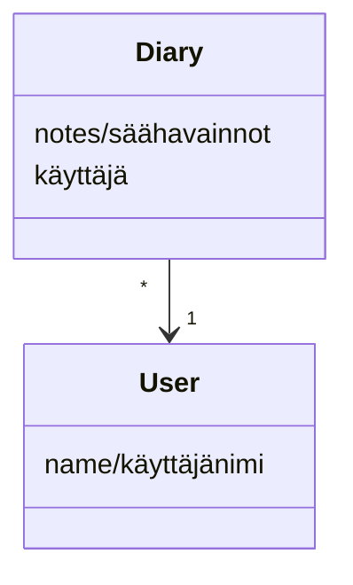

# Arkkitehtuurikuvaus #

## Sovelluksen rakenne ##

Sovellus koostuu neljästä pääosiosta. *Base* pitää sisällään sovelluksen tarvitsemat luokat, joita sovellus käyttää kohdetyyppeinä. *Ui* vastaa sovelluksen käyttöliittymään liittyvästä koodista, ja *services* taas sovelluslogiikasta. *Working* sisältää tietojen tallennuksen toiminnallisuuden.

## Käyttöliittymä ##

Sovelluksen käyttöliittymässä on tietyt näkymät, jotka ovat

1. Kirjautumisikkuna
2. Ikkuna uuden käyttäjän luomiselle
3. Näkymä kirjatuista säähavainnoista

Kaikilla näkymillä on oma toteutusluokka ui-osiossa. Kaikkien toiminnallisuudesta vastaa luokka UI. Sovelluslogiikka ja käyttöliittymä ovat erillisiä toisistaan, jotta koodia olisi helpompi lukea.

## Sovelluslogiikka ##

Luokat Note ja Diary toimivat sovelluksen pohjana, ja kuvaavat sovellukseen kirjautunutta käyttäjää sekä tämän kirjaamia käyttäjän säähavaintoja.

Luokka NoteService hoitaa sovelluksen toiminnallisuuden. Se mahdollistaa käyttöliittymän toiminnan erilaisilla metodeilla, joita ovat muun muassa:

- **login(username)** - kirjaa käyttäjän sisään

- **get_notes()** - hakee käyttäjän kirjaamat muistiinpanot

- **diary_note(note)** - luo uuden muistiinpanon

## Tietojen talletus ##

Tietoja tallennetaan working-osion luokissa *Note* ja *AboutUsers*. Kaikki käyttäjät tallentuvat AboutUsers-luokan avulla SQLite-tietokantaan, ja käyttäjien muistiinpanot taas yhteen csv-tiedostoon.

Muistiinpanojen lisäksi csv-tiedostoon kirjataan rivin alkuun käyttäjä olio-muodossa, eli käyttäjän SQLite-tietokantaan tallentuva id-numero sekä käyttäjänimi. Nämä arvot erotetaan toisistaan kaksoispisteellä (:).

Käyttäjien tallennus (id-numero ja käyttäjänimi) tapahtuu siis SQLite-tietokannan taulukkoon, joka alustetaan tiedostossa *initialize_database.py*.

## Päätoiminnallisuus ##

**Olemassa olevan käyttäjän kirjautuminen**

Tähän asiaa.

**Uuden käyttäjän rekisteröiminen**

Tähänkin.

**Muistiinpanon kirjaaminen**

Päläpälä.

## Häröt sovelluksessa ##

Pylint ilmoittaa kutsuttavasta id-asiasta *jotain*. Kirjaa tähän tarkemmin.
