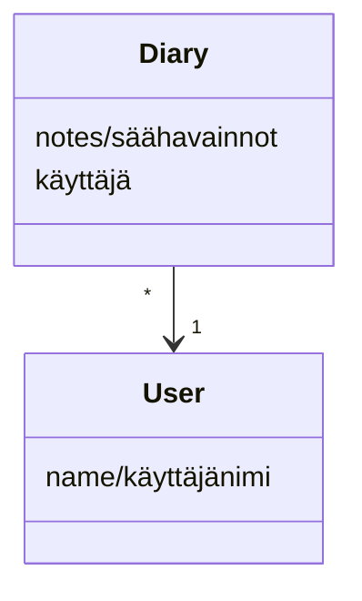

# Arkkitehtuurikuvaus #

## Sovelluksen rakenne ##

Sovellus koostuu neljästä pääosiosta. *Base* pitää sisällään sovelluksen tarvitsemat luokat, joita sovellus käyttää kohdetyyppeinä. *Ui* vastaa sovelluksen käyttöliittymään liittyvästä koodista, ja *services* taas sovelluslogiikasta. *Working* sisältää tietojen tallennuksen toiminnallisuuden.

## Käyttöliittymä ##

Sovelluksen käyttöliittymässä on tietyt näkymät, jotka ovat

1. Kirjautumisikkuna
2. Ikkuna uuden käyttäjän luomiselle
3. Näkymä kirjatuista säähavainnoista

Kaikilla näkymillä on oma toteutusluokka ui-osiossa. Kaikkien toiminnallisuudesta vastaa luokka UI. Sovelluslogiikka ja käyttöliittymä ovat erillisiä toisistaan, jotta koodia olisi helpompi lukea.

## Sovelluslogiikka ##

Luokat Note ja Diary toimivat sovelluksen pohjana, ja kuvaavat sovellukseen kirjautunutta käyttäjää sekä tämän kirjaamia käyttäjän säähavaintoja.

Luokka NoteService hoitaa sovelluksen toiminnallisuuden. Se mahdollistaa käyttöliittymän toiminnan erilaisilla metodeilla, joita ovat muun muassa:

- **login(username)** - kirjaa käyttäjän sisään

- **get_notes()** - hakee käyttäjän kirjaamat muistiinpanot

- **diary_note(note)** - luo uuden muistiinpanon

## Tietojen talletus ##

Tietoja tallennetaan working-osion luokissa *Note* ja *AboutUsers*. Kaikki käyttäjät tallentuvat AboutUsers-luokan avulla SQLite-tietokantaan, ja käyttäjien muistiinpanot taas yhteen csv-tiedostoon.

Muistiinpanojen lisäksi csv-tiedostoon kirjataan rivin alkuun käyttäjä olio-muodossa, eli käyttäjän SQLite-tietokantaan tallentuva id-numero sekä käyttäjänimi. Nämä arvot erotetaan toisistaan kaksoispisteellä (:).

Käyttäjien tallennus (id-numero ja käyttäjänimi) tapahtuu siis SQLite-tietokannan taulukkoon, joka alustetaan tiedostossa *initialize_database.py*.

## Päätoiminnallisuus ##

**Olemassa olevan käyttäjän kirjautuminen**

Sovelluksen toiminta tässä vaiheessa etenee seuraavasti:

Sisäänkirjautuessa "Käyttäjänimi" kenttään syötetään oikea käyttäjänimi ja painetaan "Kirjaudu sisään" painiketta. Tämä saa aikaan sen, että sovelluslogiikan *NoteService* metodia *login* kutsutaan käyttäjänimi parametrina. *AboutUsers*-luokan avulla sovelluslogiikka katsoo, onko käyttäjänimi jo olemassa tietokannassa. Jos on, sovellus kirjaa käyttäjän sisään ja käyttöliittymä avaa *NotesView* ikkunan. Jos taas sovellukseen koittaa kirjautua käyttäjänimellä, joka ei ole tallennettuna tietokantaan, antaa *AboutUsers*-luokka None-tiedon sovelluslogiikalle, joka antaa käyttäjälle tiedon virheellisestä käyttäjänimestä.

**Uuden käyttäjän rekisteröiminen**

Sovelluksen toiminta tässä vaiheessa etenee seuraavasti:

Uuden käyttäjän rekisteröinti -ikkunassa "Käyttäjänimi"-kenttään syötetään uusi käyttäjänimi.  Kun tämän jälkeen painetaan "Luo uusi ja kirjaudu" painiketta, sovelluslogiikan *create_new_user*-metodia kutsutaan parametrina kirjattu uusi käyttäjänimi. Sovelluslogiikka tarkastaa *AboutUsers*-luokan kautta, onko käyttäjänimi jo käytössä. *AboutUsers*-luokka antaa tästä tiedon sovelluslogiikalle, joka tarvittaessa kertoo käyttäjälle, jos käyttäjänimi on jo olemassa. Jos taas käyttäjänimi ei ole vielä olemassa, sovelluslogiikka luo uuden *User*-olion ja tallentaa sen *AboutUsers*-luokan *create*-metodia kutsumalla. Tämän jälkeen uusi käyttäjä kirjataan sovellukseen sisälle, ja käyttöliittymä avaa *NotesView*-ikkunan.

**Muistiinpanon kirjaaminen**

Sovelluksen toiminta tässä vaiheessa etenee seuraavasti:

Sisäänkirjautuneena käyttäjä voi syöttää tekstikenttään jonkin säähavainnon. Tämän jälkeen painamalla "Kirjaa" painiketta käyttöliittymä kertoo sovelluslogiikalle, että uusi säähavainto on tehty. Se kutsuu sovelluslogiikan *diary_note*-metodia parametrina juuri kirjattu säähavainto. Sovelluslogiikka tekee tästä havainnosta *Diary*-olion ja kutsuu *Note*-luokan metodia *new_note*, jonka avulla säähavainto tallennetaan csv-tiedostoon käyttäjänimen kera. Seuraavaksi käyttöliittymä päivittää ikkunanäkymän kutsumalla sisäisesti metodia *_initialize_note_list*, ja uusi säähavainto siirtyy listan jatkeeksi.

## Häröt sovelluksen rakenteessa ##

Pylint ilmoittaa luokan *create_user* metodista *create*, että siinä määritellään uudelleen sisäänrakennettu id-numero (W0622: Redefining built-in 'id' (redefined-builtin)). Kuitenkin, jos tämän määrittelyrivin ottaa pois, ei sovellus toimi halutulla tavalla.
