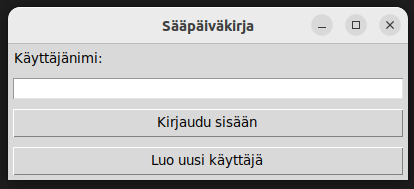

## Käyttöohje ##

Lataa Release-linkin kautta projektin uusin lähdekoodi *Source code*-kohdasta.

Jos ohjelman tallennuksessa käytettävien tiedostojen nimiä haluaa konfiguroida, löytyvät ne *.env*-tiedostosta. Jos tiedostoja ei vielä ole *data*-hakemistossa, ne tehdään hakemistoon automaattisesti.

#Tähän ehkäpä kuva tiedostonimien muodosta?

## Käynnistys ##

Jotta ohjelma toimii, täytyy asentaa riippuvuudet. Käytetään komentoa:

- **poetry install**

Sitten täytyy siirtyä virtuaaliympäristöön komennolla:

- **poetry shell**

Sovelluksen alustus hoituu komennolla:

- **poetry run invoke build**

Sitten ohjelma käynnistyy komennolla:

- **poetry run invoke start**

## Sisäänkirjautuminen olemassa olevalla käyttäjällä ##

Sovellus avaa ikkunan, johon on mahdollista syöttää jo luotu käyttäjänimi, ja painaa tämän jälkeen "Kirjaudu sisään" -painiketta.

## Uuden käyttäjän luominen ##

Jos käyttäjää ei ole vielä luotu, voi sellaisen luoda painamalla "Luo uusi käyttäjä" -painiketta. Seuraavaan avautuvaan ikkunaan tulee "Käyttäjänimi" -kenttä, johon voi syöttää uuden käyttäjän. Tämän jälkeen painamalla "Luo uusi ja kirjaudu" -painiketta uusi käyttäjä luodaan, ja se kirjautuu heti sovellukseen.

## Säämuistiinpanon luominen ##

Sovellukseen kirjauduttua aukeaa ikkuna, jossa on näkyvillä sekä käyttäjän edelliset muistiinpanot, että kirjoituskenttä uusille muistiinpanoille. Kenttään kirjoittamalla ja sen jälkeen "Kirjaa" -painiketta painamalla uusi muistiinpano tulee näkyville listan jatkoksi.

## Uloskirjautuminen ##

Painamalla "Uloskirjautuminen" -painiketta sovellus kirjaa käyttäjän ulos ja palaa sisäänkirjautumissivulle.
