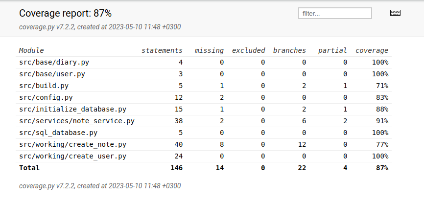

# Testausdokumentti #

Ohjelmaa ja sen toimivuutta on testattu yksikkötesteillä sekä eri luokkia yhdistelevillä testeillä unittestillä. Toimivuus on testattu Python-versiolla 3.10.

## Sovelluslogiikka ##

Luokka *NoteService*, joka vastaa sovelluslogiikasta, on testattu testiluokassa *TestNoteService*. Testissä on mukana *TemporaryNote*- sekä *TemporaryAboutUsers*-luokat, jotka tallentavat testin aikaiset tiedot, ja ne alustavat *NoteService*-olion testejä varten.

## Base-osion luokat ##

Base-osion luokkia *User* ja *Diary* testataan omissa testiluokissaan *TestBaseUser* ja *TestBaseDiary*, joissa luodaan väliaikaisesti käyttäjä, sekä muistiinpano jolla on tietty kirjaaja.

## Working-osion luokat ##

Working-osion luokkia *AboutUsers* ja *Note* testataan luokissa *TestAboutUsers* ja *TestNote*. Luokkia testataan vain testien aikana luoduilla tiedostoilla.

## Testikattavuus ##

Sovelluksen testauksen haaraumakattavuus on 87%. Käyttöliittymäosiota ei otettu testeihin mukaan. Testaamatta jäi myös uloskirjautuminen.

## Järjestelmätestaus ##

Sovelluksen toimivuutta on testattu manuaalisesti. Testaus on suoritettu sekä siten, että tiedostot käyttäjien
sekä muistiinpanojen tallentamiselle on ollut jo olemassa, sekä siten, että tiedostoja ei ole ollut valmiina ja sovellus on alustanut ne itse.

## Toiminnallisuus ##

Määrittelydokumentin toiminnallisuudet (päivitetyiltä osin) on testattu. Sovelluksen aikana avautuviin kirjauskenttiin on koitettu syöttää toimimattomia arvoja.

## Pylint ##

Pylint ilmoittaa luokan *create_user* metodista *create*, että siinä määritellään uudelleen sisäänrakennettu id-numero (W0622: Redefining built-in 'id' (redefined-builtin)). Kuitenkin, jos tämän määrittelyrivin ottaa pois, ei sovellus toimi halutulla tavalla.
