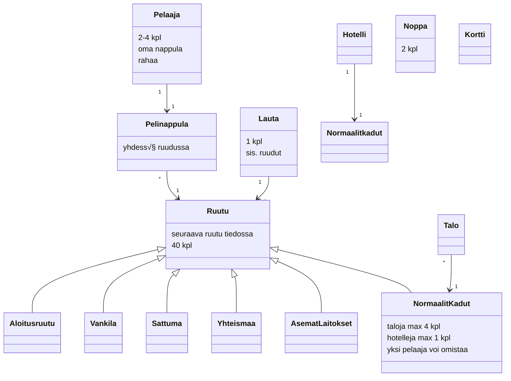

```mermaid
 classDiagram
      Pelaaja "1" --> "1" Pelinappula
      Pelinappula "*" --> "1" Ruutu
      Lauta "1" --> "*" Ruutu
      Ruutu <|-- Aloitusruutu
      Ruutu <|-- Vankila
      Ruutu <|-- Sattuma
      Ruutu <|-- Yhteismaa
      Ruutu <|-- AsematLaitokset
      Ruutu <|-- NormaalitKadut
      Talo "*" --> "1" NormaalitKadut
      Hotelli "1" --> "1" Normaalitkadut
      class Ruutu{
          seuraava ruutu tiedossa
          40 kpl
      }
      class AsematLaitokset{
      }
      class NormaalitKadut{
          taloja max 4 kpl
          hotelleja max 1 kpl
          yksi pelaaja voi omistaa
      }
      class Aloitusruutu{
      }
      class Vankila{
      }
      class Sattuma{
      }
      class Yhteismaa{
      }
      class Lauta{
          1 kpl
          sis. ruudut
      }
      class Pelaaja{
          2-4 kpl
          oma nappula
          rahaa
      }
      class Noppa{
          2 kpl
      }
      class Pelinappula{
          yhdessä ruudussa
      }
      class Kortti{
      }
      class Talo{
      }
      class Hotelli{
      }
```
